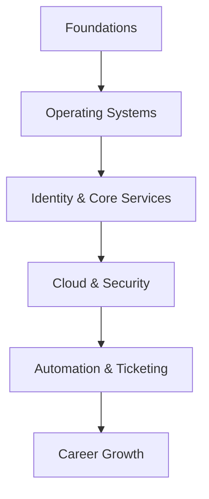

> [!NOTE|color-yellow]
> 🌐 **MASTER INDEX / MOC**

`#complete` `#beginner` `#none`

# Master Map of Content (MOC)

> [!abstract] Overview
> The Master Index is the central nervous system of the vault. Yeh pura blueprint hai L1 se L3 SysAdmin banne tak ka. Use this as your starting point to find runbooks, references, and interview prep guides. Har sub-topic apne dedicated folder mein hai.

---
## 🧠 Concept Overview

- **What it is** — The master navigational map and blueprint for the entire Desktop Support Engineer (L1 to L3) Knowledge Vault.
- **Why it matters** — IT Support mein time = money. Jab ticket aata hai toh turant solution milna chahiye. Yeh index tumhe batayega kaunsi cheez kahan hai.
- **Where you see this** — Daily morning check-ins, onboarding new engineers, and finding the correct troubleshooting runbook quickly.

**L1 / L2 / L3 Split:**

| 👨‍💻 Level | 📋 Responsibility |
|---------|-----------------|
| **L1** | Uses the index to find troubleshooting runbooks and basic command references |
| **L2** | Uses it to research deeper configuration profiles, GPOs, and networking |
| **L3** | Maintains the MOC index, audits system documentation, and defines the structural framework for training junior staff |

> [!tip] Seedha Simple Mein
> *Yeh tumhara Vault ka Google hai. Jo bhi dhoondhna hai, pehle yahan aake apna topic dhundo. Folder structure step-by-step banaya gaya hai taaki tum ek logical path follow kar sako.*

---
## 💡 Vault Architecture

> [!info] Think of it like this...
> **Building a Skyscraper** is like **This Vault** because...
>
> - **[01-Foundations]** = Base of the building (Hardware, Networking).
> - **[02-Operating-Systems]** = The walls and floors (Windows, Linux).
> - **[03-Identity & 04-Cloud]** = The electricity and elevators connecting everything.
> - **[05-Automation]** = The building management system running on autopilot.

---
## 🛠️ Interactive Study & Progress Tracker

> [!warning] Pre-requisites
> Follow the sequence! Do not jump to Cloud before clearing Foundations.

### 00. Master Index & References (00-MOC)
- [ ] [[00-MOC/REF-01 Complete Command Cheat Sheet|REF-01 Complete Command Cheat Sheet]]
- [ ] [[00-MOC/REF-02 Complete Interview Q&A Bank|REF-02 Complete Interview Q&A Bank]]
- [ ] [[00-MOC/REF-03 Troubleshooting Decision Trees|REF-03 Troubleshooting Decision Trees]]
- [ ] [[00-MOC/REF-04 Lab Setup Guide|REF-04 Lab Setup Guide]]

### 01. Foundations - Hardware (01-Hardware)
- [ ] [[01-Foundations/01-Hardware/H-01 Motherboard Architecture|H-01 Motherboard Architecture]]
- [ ] [[01-Foundations/01-Hardware/H-02 Storage Deep Dive|H-02 Storage Deep Dive]]
- [ ] [[01-Foundations/01-Hardware/H-03 SMPS Power Supply Complete Guide|H-03 SMPS Power Supply Complete Guide]]
- [ ] [[01-Foundations/01-Hardware/H-04 Laptop Hardware Complete Guide|H-04 Laptop Hardware Complete Guide]]
- [ ] [[01-Foundations/01-Hardware/H-05 PC Assembly and BIOS Configuration|H-05 PC Assembly and BIOS Configuration]]
- [ ] [[01-Foundations/01-Hardware/H-06 Hardware Troubleshooting Masterclass|H-06 Hardware Troubleshooting Masterclass]]
- [ ] [[01-Foundations/01-Hardware/V-01 VMware Workstation Complete Guide|V-01 VMware Workstation Complete Guide]]
- [ ] [[01-Foundations/01-Hardware/V-02 VirtualBox Complete Guide|V-02 VirtualBox Complete Guide]]
- [ ] [[01-Foundations/01-Hardware/V-03 Hyper-V|V-03 Hyper-V]]
- [ ] [[01-Foundations/01-Hardware/V-04 Virtualization Lab Environment Setup|V-04 Virtualization Lab Environment Setup]]

### 01. Foundations - Networking (02-Networking)
- [ ] [[01-Foundations/02-Networking/N-01 Networking Fundamentals|N-01 Networking Fundamentals]]
- [ ] [[01-Foundations/02-Networking/N-02 Network Devices Deep Dive|N-02 Network Devices Deep Dive]]
- [ ] [[01-Foundations/02-Networking/N-03 Ethernet and MAC Address|N-03 Ethernet and MAC Address]]
- [ ] [[01-Foundations/02-Networking/N-04 IPv4 Addressing Complete Guide|N-04 IPv4 Addressing Complete Guide]]
- [ ] [[01-Foundations/02-Networking/N-05 IPv6 Complete Guide|N-05 IPv6 Complete Guide]]
- [ ] [[01-Foundations/02-Networking/N-06 Switching — VLANs and Trunking|N-06 Switching — VLANs and Trunking]]
- [ ] [[01-Foundations/02-Networking/N-07 Routing — Static and Dynamic|N-07 Routing — Static and Dynamic]]
- [ ] [[01-Foundations/02-Networking/N-08 IP Services — DHCP DNS NAT|N-08 IP Services — DHCP DNS NAT]]
- [ ] [[01-Foundations/02-Networking/N-09 Access Control Lists|N-09 Access Control Lists]]
- [ ] [[01-Foundations/02-Networking/N-10 Network Troubleshooting Complete|N-10 Network Troubleshooting Complete]]
- [ ] [[01-Foundations/02-Networking/N-11 Wireless Networking|N-11 Wireless Networking]]
- [ ] [[01-Foundations/02-Networking/N-12 Network Security|N-12 Network Security]]

### 02. Operating Systems - Windows (03-Windows-OS)
- [ ] [[02-Operating-Systems/03-Windows-OS/WIN-01 BitLocker|WIN-01 BitLocker]]
- [ ] [[02-Operating-Systems/03-Windows-OS/WIN-02 Device Manager|WIN-02 Device Manager]]
- [ ] [[02-Operating-Systems/03-Windows-OS/WIN-03 Event Viewer|WIN-03 Event Viewer]]
- [ ] [[02-Operating-Systems/03-Windows-OS/WIN-04 Registry|WIN-04 Registry]]
- [ ] [[02-Operating-Systems/03-Windows-OS/WIN-05 SFC and DISM|WIN-05 SFC and DISM]]
- [ ] [[02-Operating-Systems/03-Windows-OS/WIN-06 Task Scheduler|WIN-06 Task Scheduler]]
- [ ] [[02-Operating-Systems/03-Windows-OS/WIN-07 User Profiles|WIN-07 User Profiles]]
- [ ] [[02-Operating-Systems/03-Windows-OS/WIN-08 Windows Services|WIN-08 Windows Services]]
- [ ] [[02-Operating-Systems/03-Windows-OS/WIN-09 Windows Update|WIN-09 Windows Update]]
- [ ] [[02-Operating-Systems/03-Windows-OS/WIN-10 FSLogix|WIN-10 FSLogix]]
- [ ] [[02-Operating-Systems/03-Windows-OS/WIN-11 RDS Complete Guide|WIN-11 RDS Complete Guide]]
- [ ] [[02-Operating-Systems/03-Windows-OS/WIN-12 WDS and MDT|WIN-12 WDS and MDT]]

### 02. Operating Systems - Linux RHEL (04-Linux-RHEL)
- [ ] [[02-Operating-Systems/04-Linux-RHEL/L-01 Linux Introduction and Architecture|L-01 Linux Introduction and Architecture]]
- [ ] [[02-Operating-Systems/04-Linux-RHEL/L-02 Command Line Basics|L-02 Command Line Basics]]
- [ ] [[02-Operating-Systems/04-Linux-RHEL/L-03 File System Management|L-03 File System Management]]
- [ ] [[02-Operating-Systems/04-Linux-RHEL/L-04 Text Editors and File Viewing|L-04 Text Editors and File Viewing]]
- [ ] [[02-Operating-Systems/04-Linux-RHEL/L-05 User and Group Management|L-05 User and Group Management]]
- [ ] [[02-Operating-Systems/04-Linux-RHEL/L-06 File Permissions and Ownership|L-06 File Permissions and Ownership]]
- [ ] [[02-Operating-Systems/04-Linux-RHEL/L-07 Process Management|L-07 Process Management]]
- [ ] [[02-Operating-Systems/04-Linux-RHEL/L-08 Services and Systemd|L-08 Services and Systemd]]
- [ ] [[02-Operating-Systems/04-Linux-RHEL/L-09 SSH Configuration and Security|L-09 SSH Configuration and Security]]
- [ ] [[02-Operating-Systems/04-Linux-RHEL/L-10 Software Management — YUM DNF|L-10 Software Management — YUM DNF]]
- [ ] [[02-Operating-Systems/04-Linux-RHEL/L-11 File Systems and Storage in Linux|L-11 File Systems and Storage in Linux]]
- [ ] [[02-Operating-Systems/04-Linux-RHEL/L-12 Network Configuration in Linux|L-12 Network Configuration in Linux]]
- [ ] [[02-Operating-Systems/04-Linux-RHEL/L-13 Bash Scripting for Sysadmins|L-13 Bash Scripting for Sysadmins]]
- [x] [[02-Operating-Systems/04-Linux-RHEL/L-14 Linux Security Hardening|L-14 Linux Security Hardening]]
- [x] [[02-Operating-Systems/04-Linux-RHEL/L-15 LVM — Logical Volume Manager|L-15 LVM — Logical Volume Manager]]
- [ ] [[02-Operating-Systems/04-Linux-RHEL/L-16 Cron Jobs and Task Scheduling|L-16 Cron Jobs and Task Scheduling]]
- [ ] [[02-Operating-Systems/04-Linux-RHEL/L-17 Linux Log Management|L-17 Linux Log Management]]
- [ ] [[02-Operating-Systems/04-Linux-RHEL/L-18 Linux Performance Monitoring|L-18 Linux Performance Monitoring]]
- [ ] [[02-Operating-Systems/04-Linux-RHEL/L-19 Docker Basics for Linux Admins|L-19 Docker Basics for Linux Admins]]
- [ ] [[02-Operating-Systems/04-Linux-RHEL/L-20 Linux Troubleshooting Masterclass|L-20 Linux Troubleshooting Masterclass]]
- [ ] [[02-Operating-Systems/04-Linux-RHEL/L-21 RPM-Package-Building|L-21 RPM-Package-Building]]
- [ ] [[02-Operating-Systems/04-Linux-RHEL/L-22 Firewalld|L-22 Firewalld]]
- [ ] [[02-Operating-Systems/04-Linux-RHEL/L-23 Filesystem|L-23 Filesystem]]

### 03. Identity & Core Services - Windows Server (05-Windows-Server)
- [ ] [[03-Identity-and-Core-Services/05-Windows-Server/BAK-01 Windows Server Backup|BAK-01 Windows Server Backup]]
- [ ] [[03-Identity-and-Core-Services/05-Windows-Server/IIS|IIS]]
- [ ] [[03-Identity-and-Core-Services/05-Windows-Server/Roles|Windows Server Roles]]
- [ ] [[03-Identity-and-Core-Services/05-Windows-Server/WS-01 Windows Server 2022 Introduction|WS-01 Windows Server 2022 Introduction]]
- [ ] [[03-Identity-and-Core-Services/05-Windows-Server/WS-03 DNS Server — Install and Configure|WS-03 DNS Server — Install and Configure]]
- [ ] [[03-Identity-and-Core-Services/05-Windows-Server/WS-04 DHCP Server — Install and Configure|WS-04 DHCP Server — Install and Configure]]
- [ ] [[03-Identity-and-Core-Services/05-Windows-Server/WS-09 File Server and FSRM|WS-09 File Server and FSRM]]
- [ ] [[03-Identity-and-Core-Services/05-Windows-Server/WS-10 DFS — Distributed File System|WS-10 DFS — Distributed File System]]
- [ ] [[03-Identity-and-Core-Services/05-Windows-Server/WS-11 Storage — Disk Management and RAID|WS-11 Storage — Disk Management and RAID]]
- [ ] [[03-Identity-and-Core-Services/05-Windows-Server/WS-12 Hyper-V Virtualization|WS-12 Hyper-V Virtualization]]
- [ ] [[03-Identity-and-Core-Services/05-Windows-Server/WS-14 VPN and Remote Access (RRAS)|WS-14 VPN and Remote Access (RRAS)]]
- [ ] [[03-Identity-and-Core-Services/05-Windows-Server/WS-15 Print Server|WS-15 Print Server]]
- [ ] [[03-Identity-and-Core-Services/05-Windows-Server/WS-16 WSUS — Windows Server Update Services|WS-16 WSUS — Windows Server Update Services]]
- [ ] [[03-Identity-and-Core-Services/05-Windows-Server/WS-17 NPS and RADIUS Server|WS-17 NPS and RADIUS Server]]
- [ ] [[03-Identity-and-Core-Services/05-Windows-Server/WS-17 SCCM-MECM|WS-17 SCCM-MECM]]
- [ ] [[03-Identity-and-Core-Services/05-Windows-Server/WS-18 SQL-Server-Administration|WS-18 SQL Server Administration]]

### 03. Identity & Core Services - Active Directory (06-Active-Directory)
- [x] [[03-Identity-and-Core-Services/06-Active-Directory/AD-Replication|AD-Replication]]
- [ ] [[03-Identity-and-Core-Services/06-Active-Directory/WS-02 Active Directory Domain Services|WS-02 Active Directory Domain Services]]
- [ ] [[03-Identity-and-Core-Services/06-Active-Directory/WS-05 Group Policy — Complete Guide|WS-05 Group Policy — Complete Guide]]
- [ ] [[03-Identity-and-Core-Services/06-Active-Directory/WS-06 Active Directory — Users Groups OUs|WS-06 Active Directory — Users Groups OUs]]
- [ ] [[03-Identity-and-Core-Services/06-Active-Directory/WS-07 Additional Domain Controllers|WS-07 Additional Domain Controllers]]
- [ ] [[03-Identity-and-Core-Services/06-Active-Directory/WS-08 FSMO Roles|WS-08 FSMO Roles]]
- [ ] [[03-Identity-and-Core-Services/06-Active-Directory/WS-13 Active Directory Certificate Services|WS-13 Active Directory Certificate Services]]

### 04. Cloud & Security - Microsoft 365 (07-Microsoft-365)
- [ ] [[04-Cloud-and-Security/07-Microsoft-365/INT-01 Microsoft Intune Introduction|INT-01 Microsoft Intune Introduction]]
- [ ] [[04-Cloud-and-Security/07-Microsoft-365/INT-02 Device Enrollment|INT-02 Device Enrollment]]
- [ ] [[04-Cloud-and-Security/07-Microsoft-365/INT-03 Compliance Policies|INT-03 Compliance Policies]]
- [ ] [[04-Cloud-and-Security/07-Microsoft-365/INT-04 Configuration Profiles|INT-04 Configuration Profiles]]
- [ ] [[04-Cloud-and-Security/07-Microsoft-365/INT-05 Application Management|INT-05 Application Management]]
- [ ] [[04-Cloud-and-Security/07-Microsoft-365/INT-06 Windows Autopilot|INT-06 Windows Autopilot]]
- [ ] [[04-Cloud-and-Security/07-Microsoft-365/INT-07 Endpoint Security in Intune|INT-07 Endpoint Security in Intune]]
- [ ] [[04-Cloud-and-Security/07-Microsoft-365/INT-08 Windows Update Management|INT-08 Windows Update Management]]
- [ ] [[04-Cloud-and-Security/07-Microsoft-365/INT-09 Intune Monitoring and Reporting|INT-09 Intune Monitoring and Reporting]]
- [ ] [[04-Cloud-and-Security/07-Microsoft-365/INT-10 Remote Device Actions|INT-10 Remote Device Actions]]
- [ ] [[04-Cloud-and-Security/07-Microsoft-365/M365-01 Microsoft 365 Administration|M365-01 Microsoft 365 Administration]]
- [ ] [[04-Cloud-and-Security/07-Microsoft-365/M365-02 Exchange Online Administration|M365-02 Exchange Online Administration]]
- [ ] [[04-Cloud-and-Security/07-Microsoft-365/M365-03 Microsoft Teams Administration|M365-03 Microsoft Teams Administration]]
- [ ] [[04-Cloud-and-Security/07-Microsoft-365/M365-04 SharePoint Online Administration|M365-04 SharePoint Online Administration]]
- [ ] [[04-Cloud-and-Security/07-Microsoft-365/M365-05 Security and Compliance|M365-05 Security and Compliance]]

### 04. Cloud & Security - Azure (08-Azure)
- [ ] [[04-Cloud-and-Security/08-Azure/AZ104-01 Azure Identity and Governance|AZ104-01 Azure Identity and Governance]]
- [ ] [[04-Cloud-and-Security/08-Azure/AZ104-02 Azure Storage Administration|AZ104-02 Azure Storage Administration]]
- [ ] [[04-Cloud-and-Security/08-Azure/AZ104-03 Azure Virtual Machines|AZ104-03 Azure Virtual Machines]]
- [ ] [[04-Cloud-and-Security/08-Azure/AZ104-04 Azure Virtual Networking|AZ104-04 Azure Virtual Networking]]
- [ ] [[04-Cloud-and-Security/08-Azure/AZ104-05 Azure Load Balancing|AZ104-05 Azure Load Balancing]]
- [ ] [[04-Cloud-and-Security/08-Azure/AZ104-06 Azure Monitor and Backup|AZ104-06 Azure Monitor and Backup]]
- [ ] [[04-Cloud-and-Security/08-Azure/AZ104-07 Defender for Cloud|AZ104-07 Defender for Cloud]]
- [ ] [[04-Cloud-and-Security/08-Azure/AZ9-01 Cloud Computing Fundamentals|AZ9-01 Cloud Computing Fundamentals]]
- [ ] [[04-Cloud-and-Security/08-Azure/AZ9-02 Azure Global Infrastructure|AZ9-02 Azure Global Infrastructure]]
- [ ] [[04-Cloud-and-Security/08-Azure/AZ9-03 Azure Compute Services|AZ9-03 Azure Compute Services]]
- [ ] [[04-Cloud-and-Security/08-Azure/AZ9-04 Azure Storage and Networking|AZ9-04 Azure Storage and Networking]]
- [ ] [[04-Cloud-and-Security/08-Azure/AZ9-05 Azure Identity and Security|AZ9-05 Azure Identity and Security]]
- [ ] [[04-Cloud-and-Security/08-Azure/AZ9-06 Azure Cost and Governance|AZ9-06 Azure Cost and Governance]]
- [ ] [[04-Cloud-and-Security/08-Azure/BAK-02 Azure Backup and Site Recovery|BAK-02 Azure Backup and Site Recovery]]

### 04. Cloud & Security - Enterprise Security (09-Security)
- [ ] [[04-Cloud-and-Security/09-Security/Access-Management|Access-Management]]
- [ ] [[04-Cloud-and-Security/09-Security/BitLocker-Deep-Dive|BitLocker-Deep-Dive]]
- [x] [[04-Cloud-and-Security/09-Security/CIA-Triad-and-Zero-Trust|CIA-Triad-and-Zero-Trust]]
- [ ] [[04-Cloud-and-Security/09-Security/Endpoint-Security-Defender|Endpoint-Security-Defender]]
- [ ] [[04-Cloud-and-Security/09-Security/Incident-Response-Playbook|Incident-Response-Playbook]]
- [ ] [[04-Cloud-and-Security/09-Security/MFA-and-Identity-Protection|MFA-and-Identity-Protection]]
- [ ] [[04-Cloud-and-Security/09-Security/Microsoft-Security-Best-Practices|Microsoft-Security-Best-Practices]]
- [ ] [[04-Cloud-and-Security/09-Security/Microsoft-Sentinel-SIEM|Microsoft-Sentinel-SIEM]]
- [ ] [[04-Cloud-and-Security/09-Security/Windows-Defender|Windows-Defender]]

### 05. Automation & Ticketing - PowerShell (10-Scripting-PowerShell)
- [x] [[05-Automation-and-Ticketing/10-Scripting-PowerShell/PS-01 PowerShell Fundamentals|PS-01 PowerShell Fundamentals]]
- [ ] [[05-Automation-and-Ticketing/10-Scripting-PowerShell/PS-02 PowerShell for Active Directory|PS-02 PowerShell for Active Directory]]
- [ ] [[05-Automation-and-Ticketing/10-Scripting-PowerShell/PS-03 PowerShell for System Administration|PS-03 PowerShell for System Administration]]
- [ ] [[05-Automation-and-Ticketing/10-Scripting-PowerShell/PS-04 PowerShell Scripting|PS-04 PowerShell Scripting]]
- [ ] [[05-Automation-and-Ticketing/10-Scripting-PowerShell/PS-05 PowerShell for Azure|PS-05 PowerShell for Azure]]
- [ ] [[05-Automation-and-Ticketing/10-Scripting-PowerShell/PS-06 PowerShell DSC|PS-06 PowerShell DSC]]

### 05. Automation & Ticketing - ITSM Ticketing (11-ITSM-Ticketing)
- [ ] [[05-Automation-and-Ticketing/11-ITSM-Ticketing/Change-and-Asset-Management|Change-and-Asset-Management]]
- [x] [[05-Automation-and-Ticketing/11-ITSM-Ticketing/ITIL-v4-and-SLA|ITIL-v4-and-SLA]]
- [ ] [[05-Automation-and-Ticketing/11-ITSM-Ticketing/Incident-and-Problem-Management|Incident-and-Problem-Management]]

### 05. Automation & Ticketing - Ansible (12-Ansible)
- [x] [[05-Automation-and-Ticketing/12-Ansible/ANS-01 Ansible for Windows Admins|ANS-01 Ansible for Windows Admins]]
- [ ] [[05-Automation-and-Ticketing/12-Ansible/ANS-02 Ansible for Linux Admins|ANS-02 Ansible for Linux Admins]]
- [ ] [[05-Automation-and-Ticketing/12-Ansible/ANS-03 Ansible Advanced Playbooks|ANS-03 Ansible Advanced Playbooks]]

### 05. Automation & Ticketing - Monitoring (13-Monitoring)
- [ ] [[05-Automation-and-Ticketing/13-Monitoring/MON-01 Nagios-Setup|MON-01 Nagios Setup]]
- [ ] [[05-Automation-and-Ticketing/13-Monitoring/MON-02 Zabbix-Complete-Guide|MON-02 Zabbix Complete Guide]]
- [ ] [[05-Automation-and-Ticketing/13-Monitoring/MON-03 Prometheus-and-Grafana|MON-03 Prometheus and Grafana]]
- [x] [[05-Automation-and-Ticketing/13-Monitoring/MON-04 Windows Performance Monitor|MON-04 Windows Performance Monitor]]
- [x] [[05-Automation-and-Ticketing/13-Monitoring/MON-05 Azure Monitor and Log Analytics|MON-05 Azure Monitor and Log Analytics]]

### 05. Automation & Ticketing - DevOps (14-DevOps-Basics)
- [x] [[05-Automation-and-Ticketing/14-DevOps-Basics/DEV-01 Docker-Fundamentals|DEV-01 Docker Fundamentals]]
- [ ] [[05-Automation-and-Ticketing/14-DevOps-Basics/DEV-02 Kubernetes-Basics|DEV-02 Kubernetes Basics]]

### 05. Automation & Ticketing - Python (15-Python-Scripting)
- [x] [[05-Automation-and-Ticketing/15-Python-Scripting/PY-01 Python-for-Sysadmins|PY-01 Python for Sysadmins]]
- [ ] [[05-Automation-and-Ticketing/15-Python-Scripting/PY-02 Python-AD-Automation|PY-02 Python AD Automation]]

### 06. Career Growth - Interview Prep (12-Interview-Prep)
- [ ] [[06-Career-Growth/12-Interview-Prep/30-60-90-Day-Plan-Template|30-60-90-Day-Plan-Template]]
- [ ] [[06-Career-Growth/12-Interview-Prep/Salary-Negotiation-Script|Salary-Negotiation-Script]]
- [ ] [[06-Career-Growth/12-Interview-Prep/Top-10-Behavioral-and-HR-Questions|Top-10-Behavioral-and-HR-Questions]]
- [ ] [[06-Career-Growth/12-Interview-Prep/Top-20-M365-and-Azure-Questions|Top-20-M365-and-Azure-Questions]]
- [ ] [[06-Career-Growth/12-Interview-Prep/Top-20-Scenario-Based-Questions|Top-20-Scenario-Based-Questions]]
- [ ] [[06-Career-Growth/12-Interview-Prep/Top-30-L2-Questions|Top-30-L2-Questions]]
- [ ] [[06-Career-Growth/12-Interview-Prep/Top-50-L1-Questions|Top-50-L1-Questions]]

### 06. Career Growth - Lab Projects (13-Lab-Projects)
- [ ] [[06-Career-Growth/13-Lab-Projects/Active-Directory-Domain-Lab|Active-Directory-Domain-Lab]]
- [ ] [[06-Career-Growth/13-Lab-Projects/Azure-Cloud-Lab|Azure-Cloud-Lab]]
- [ ] [[06-Career-Growth/13-Lab-Projects/Home-Lab-Setup|Home-Lab-Setup]]

### 06. Career Growth - Certifications (14-Certifications)
- [ ] [[06-Career-Growth/14-Certifications/AZ-104-Roadmap|AZ-104-Roadmap]]
- [ ] [[06-Career-Growth/14-Certifications/CCNA-Roadmap|CCNA-Roadmap]]
- [ ] [[06-Career-Growth/14-Certifications/MD-102-Roadmap|MD-102-Roadmap]]
- [ ] [[06-Career-Growth/14-Certifications/RHCSA-Roadmap|RHCSA-Roadmap]]

---
## ⌨️ Command Cheat Sheet

| ⌨️ Command | 🛠️ Kya karta hai | 📝 Example |
|---------|-------------|---------|
| `Get-ChildItem -Filter "*.md"` | Search all vault notes | `Get-ChildItem -Path "C:\Vault" -Filter "*.md" -Recurse` |
| `tree /F` | Show vault structure | `tree /A /F "C:\Vault"` |

---
## 🚑 Troubleshooting Guide

| ⚠️ Problem | 🔍 Wajah (Cause) | 🛠️ Fix |
|---------|-------------|-----|
| Broken Wikilinks | Manual file system edits | Rename files inside Obsidian GUI only. |
| Missing metadata | Copying text without frontmatter | Always include YAML headers in every note. |
| Mixed structure | Storing notes in the root folder | File each note under its designated category folder. |

---
## 🎫 Real-World Ticket Scenarios

### 🎫 Scenario 1: New Engineer Onboarding

> [!example] Ticket
> "A junior engineer joined the team and doesn't know where to start learning L2 routing."

**L1 Response:** Point the engineer to the Networking module: `[[01-Foundations/02-Networking/N-01 Networking Fundamentals|Networking Fundamentals]]`.
**L2 Resolution:**
- Assign a week-by-week study path using the **MOC index modules**.
- Ensure they don't skip Foundations before jumping to Azure.

---
## 🎤 Interview Questions

> [!question] Q1: How do you organize your technical documentation?
> **Answer:** "I maintain a Map of Content (MOC) index that structures documentation hierarchically from hardware and network foundations to operating systems, identity management, and cloud security frameworks, making it searchable for the entire support team."

==**Exam Tip:** Documentation is your best friend. In interviews, emphasize that structured wikis reduce MTTR (Mean Time To Resolution).==

---
## 🔗 Related Notes
- [[01-Foundations/01-Hardware/H-05 PC Assembly and BIOS Configuration|PC Assembly and BIOS Configuration]] — Core hardware base.
- [[06-Career-Growth/12-Interview-Prep/Top-50-L1-Questions|Top 50 L1 Questions]] — Career exit gateway.
