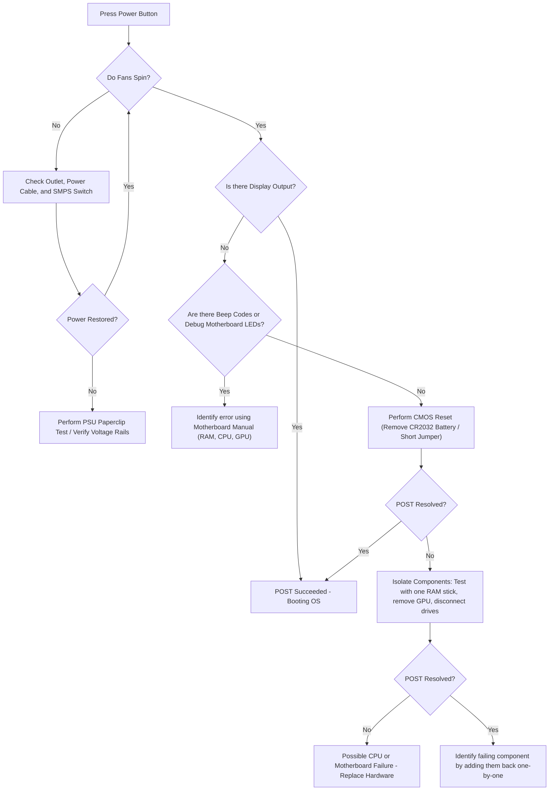
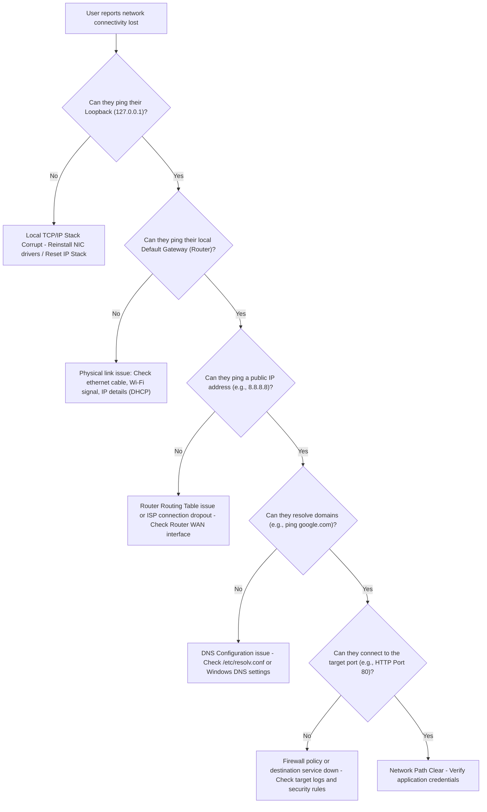
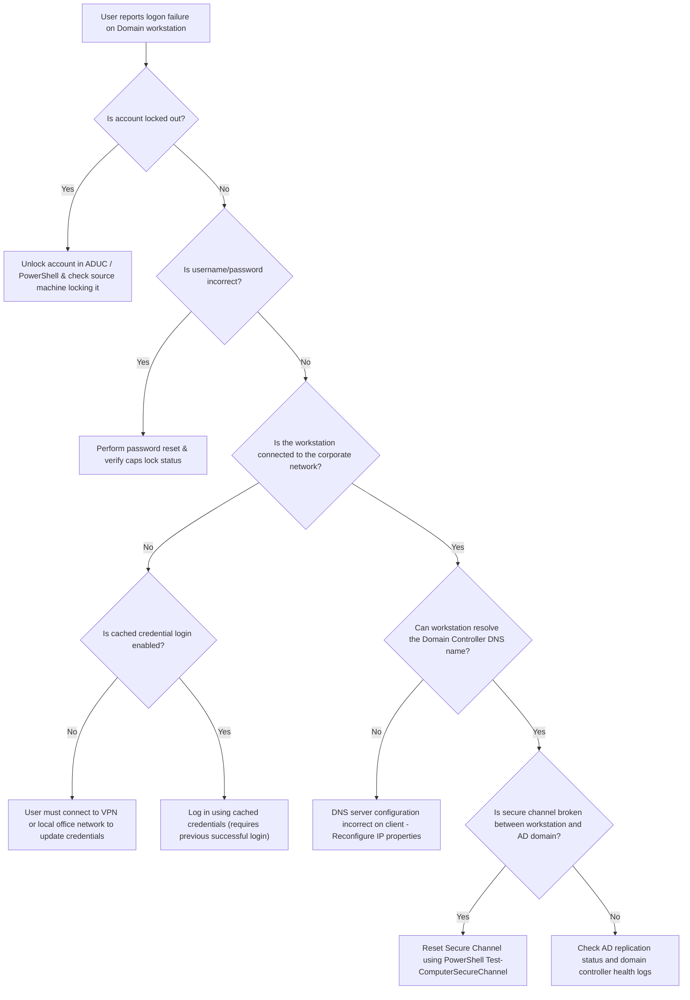
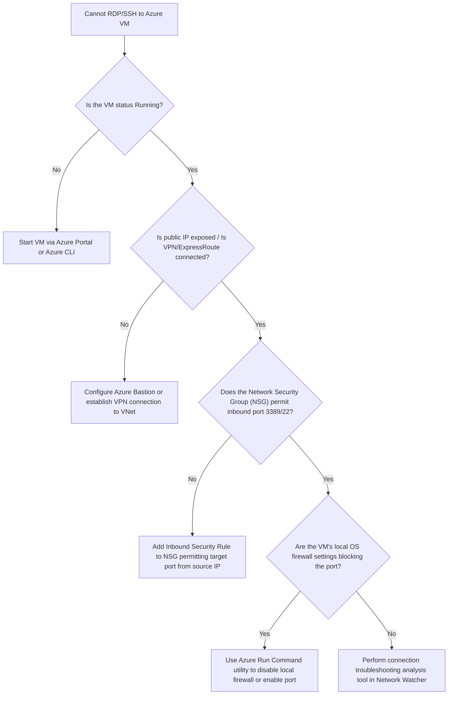
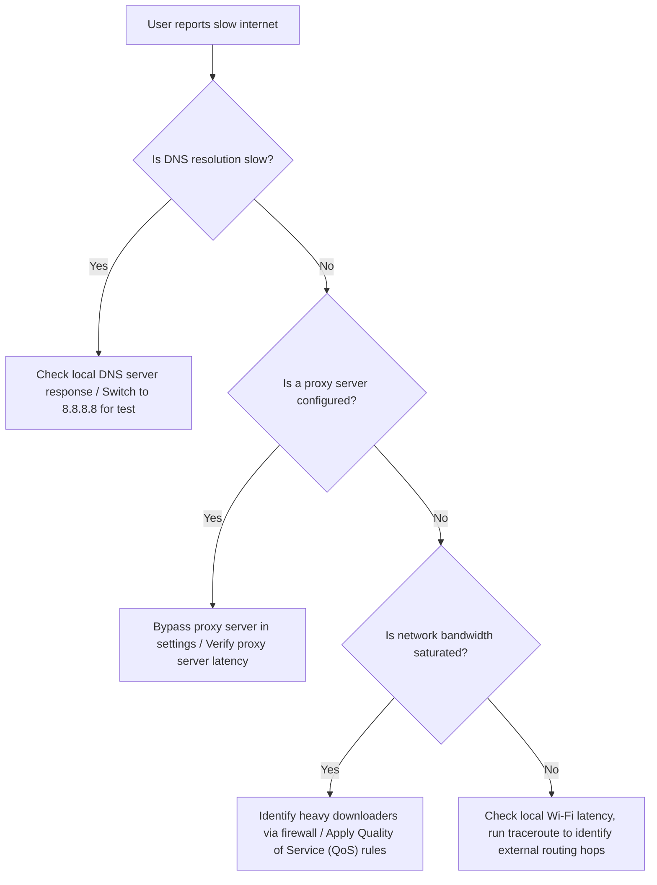
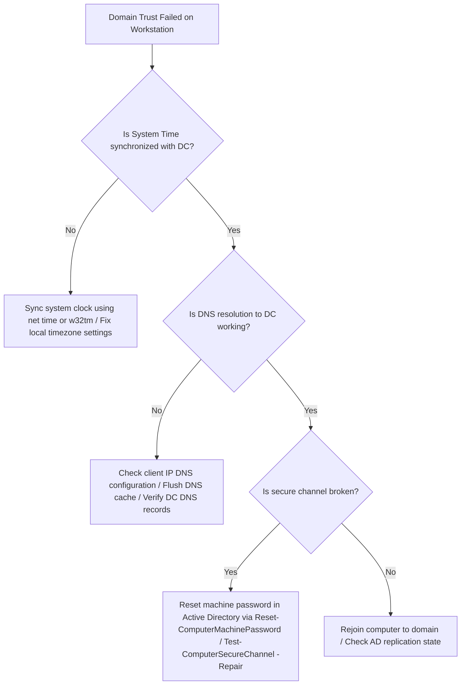
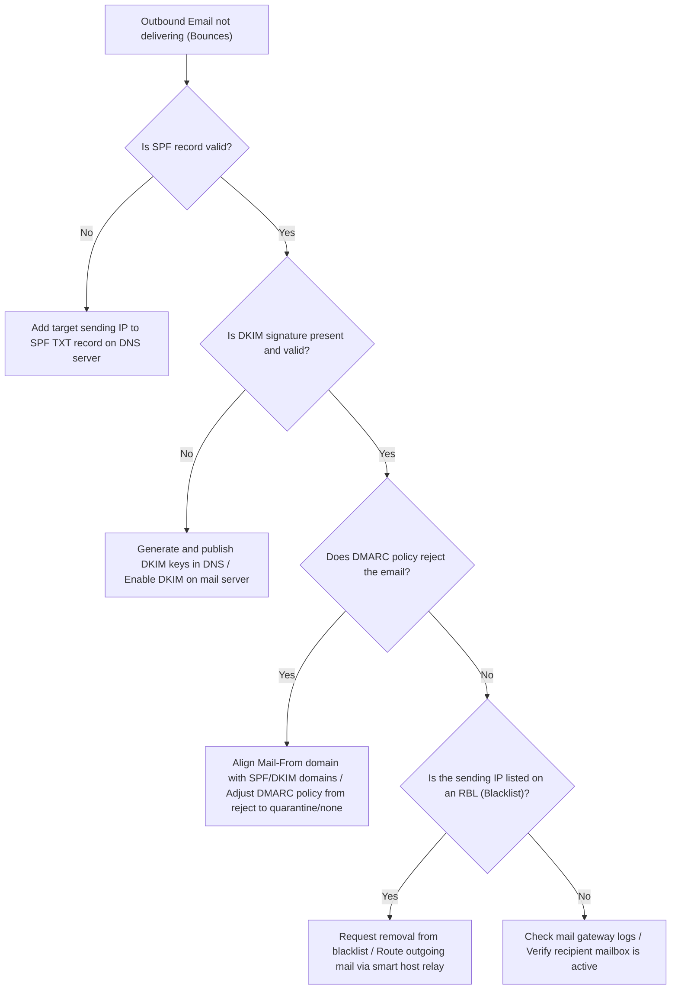
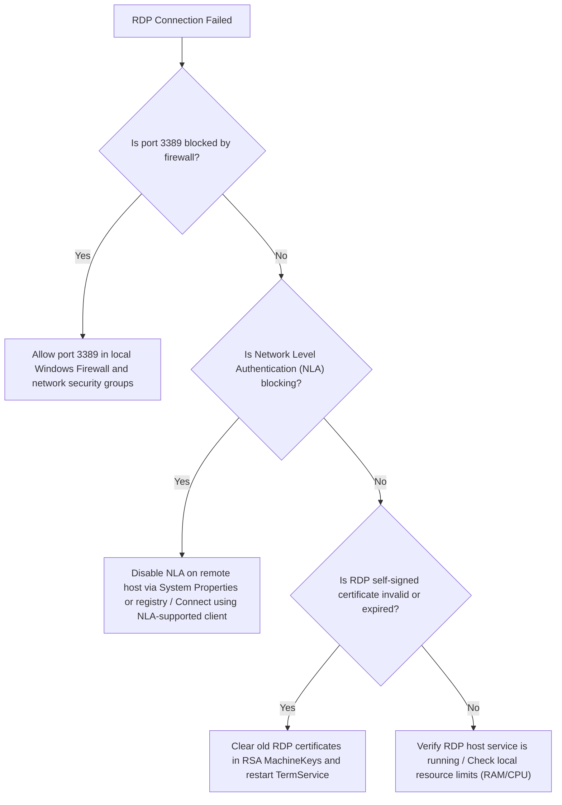
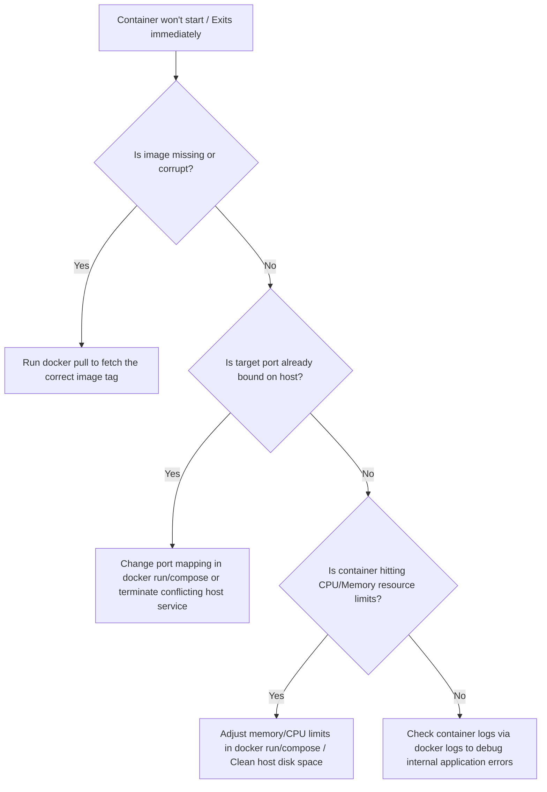

# REF-03: Troubleshooting Decision Trees

> [!abstract] Overview
> This reference note contains diagnostic decision trees for resolving common system administrator issues. It provides step-by-step troubleshooting flows for Hardware POST failures, Network connectivity dropouts, Active Directory login failures, and Azure VM connection issues.

---
## Concept
Think of troubleshooting decision trees as GPS navigation for system errors. When you run into a roadblock (e.g., a system crash or connection drop), you don't drive randomly down side streets. Instead, you follow a structured route with clear turning decisions based on the road signs (system logs and diagnostic outputs) until you reach your destination (a resolved issue).
*Seedha simple mein: Troubleshooting Decision Trees diagnostics ka step-by-step roadmap hain, jinhe follow karke aap hardware, network, active directory aur cloud infrastructure ke critical errors ko identify aur fix kar sakte hain.*

---
## Technical Deep Dive: Diagnostic Flowcharts

### 1. Hardware POST Failure Flowchart
This flowchart details how to diagnose a machine that fails to complete the Power-On Self-Test (POST).



---

### 2. Network Connectivity Diagnostics Flowchart
This flowchart details how to diagnose client-side network connection dropouts.



---

### 3. Active Directory User Login Failure Flowchart
This flowchart details how to diagnose a user unable to log into their domain account.



---

### 4. Azure VM Connection Failure Flowchart
This flowchart details how to diagnose RDP or SSH connection failures to an Azure Virtual Machine.



---

### 5. Slow Internet Diagnostic Flowchart
This flowchart details how to diagnose slow internet connectivity for a user.



---

### 6. Domain Trust Relationship Failure Flowchart
This flowchart details how to troubleshoot Domain Trust failed errors on domain-joined workstations.



---

### 7. Email Delivery Failure Flowchart
This flowchart details how to diagnose outbound emails failing to deliver or getting rejected by external recipients.



---

### 8. RDP Connection Failure Flowchart
This flowchart details how to diagnose RDP connection failures on local or remote servers.



---

### 9. Container Startup Failure Flowchart
This flowchart details how to diagnose containers failing to launch or exiting immediately.



---
## Step-by-Step Lab
> [!info] Lab Setup Needed
> Access to a Windows client machine and a Domain Controller (or virtual equivalent) to test Secure Channel diagnostic commands.

### Step 1: Verify local client network stack
Run the loopback ping test on your client machine:
```cmd
ping 127.0.0.1
```

### Step 2: Query DNS and local gateway
Determine default gateway configuration and query DNS status:
```cmd
ipconfig
nslookup google.com
```

### Step 3: Test AD Workstation Secure Channel
On a domain-joined Windows client, check the secure trust link to the domain controller using PowerShell:
```powershell
Test-ComputerSecureChannel -Verbose
```
If this returns `$false`, repair the secure channel connection:
```powershell
Test-ComputerSecureChannel -Repair -Credential (Get-Credential)
```

### Step 4: Verify Results
Confirm the connection test returns `True` and the client can access domain shares.

---
## Commands Reference
```powershell
Test-Connection -ComputerName "google.com"         # Modern PowerShell ping utility
Resolve-DnsName -Name "google.com"                 # Detailed DNS resolution query
Test-NetConnection -ComputerName "vmip" -Port 3389 # Tests if port 3389 is listening on target IP
```

---
## Troubleshooting Scenarios

### Scenario 1: Workstation Secure Channel Failure (Domain Trust Relationship Lost)
**Ticket:** "User cannot log into domain workstation. Error: The trust relationship between this workstation and the primary domain failed."
**L1 Resolution:** Log into the machine using a local administrator account. Verify IP configuration, DNS settings, and network reachability to the Domain Controller. Run `Test-ComputerSecureChannel` in PowerShell to verify secure channel status.
**Escalation Trigger:** The secure channel check returns `False` and cannot be repaired due to access restrictions or missing domain credentials.
**L2 Resolution:** Open PowerShell as Administrator. Run `Reset-ComputerMachinePassword -Server "DCName" -Credential (Get-Credential)` or run `Test-ComputerSecureChannel -Repair -Credential (Get-Credential)` using domain administrator credentials to restore the trust relationship, then reboot the workstation.

### Scenario 2: Azure VM RDP Connection Failure
**Ticket:** "Sysadmin cannot RDP into Azure VM Rocky-Server-01, although the Network Security Group (NSG) allows inbound port 3389."
**L1 Resolution:** Verify VM status is "Running" in Azure Portal. Run `Test-NetConnection -ComputerName [VM-IP] -Port 3389` to verify port status. Check Network Security Group rules to confirm inbound port 3389 is allowed.
**Escalation Trigger:** Port 3389 remains closed or unreachable, suggesting OS-level firewall blockages or a crashed Remote Desktop service.
**L2 Resolution:** Navigate to the VM page in the Azure Portal. Under **Help > Reset password**, reset RDP configuration. If that fails, go to **Operations > Run Command**, run `RunPowerShellScript` to verify/start RDP service: `net start termservice`, and reset the Windows Firewall profile to allow RDP traffic: `netsh advfirewall firewall set rule group="remote desktop" new enable=Yes`.

---
## Common Mistakes
> [!warning] Avoid These
> Jumping directly to hardware replacement before ruling out power connections and CMOS configuration errors during POST failures.
> Assuming that a network issue is an ISP dropout before checking loopback and local gateway ping responses.
> Deleting and recreating computer accounts in Active Directory to fix secure channel errors. This destroys SID histories and folder permissions; use password resets instead.

---
## Pro Tips
> [!tip] Field Experience
> Keep a copy of these diagnostic trees printed out or accessible offline (e.g., saved locally on your phone). When the corporate network drops or the AD system goes offline, you won't have access to search engines or cloud documentation.
> When troubleshooting networking, start from the bottom (Physical layer) and work your way up. Check cables, links, and IP configurations before adjusting DNS and firewall rules.

---
## Quick Revision Table
| # | Incident Class | Initial Action | Verification Command |
|---|----------------|----------------|----------------------|
| 1 | POST Failure | Clear CMOS | Monitor Motherboard Debug LEDs |
| 2 | Network Lost | Ping Loopback | `ping 127.0.0.1` |
| 3 | AD Login Fail | Check Account Lock | `Search-ADAccount -LockedOut` |
| 4 | Secure Channel | Run Secure Test | `Test-ComputerSecureChannel` |
| 5 | Azure VM Down | Check NSG Rules | `Test-NetConnection -Port 3389` |

---
## Interview Q&A

**Q1: Explain how you would troubleshoot a workstation that cannot log into the Active Directory domain, and how you would verify the secure channel status.**
A: I start by verifying physical network connectivity and DNS configuration on the client. I run `ipconfig /all` to ensure the DNS server points to the Domain Controllers. If the client can resolve and ping the DC but login still fails with a trust relationship error, I test the secure channel status using the PowerShell command `Test-ComputerSecureChannel -Verbose`. If it returns false, I repair the secure channel by running `Test-ComputerSecureChannel -Repair -Credential (Get-Credential)` or resetting the machine account password using `Reset-ComputerMachinePassword`.

**Q2: A web server running on an Azure Virtual Machine is unreachable from the internet. Walk me through your troubleshooting process.**
A:
- **Situation**: A web server on an Azure VM was reported as unreachable on Port 443.
- **Task**: I needed to identify the failure point across the cloud network path.
- **Action**: I checked the VM status in the Azure Portal to confirm it was running. I then used **Azure Network Watcher IP Flow Verify** to test traffic on port 443. This showed the traffic was blocked by the Network Security Group (NSG). I updated the NSG rules to permit inbound TCP port 443 traffic.
- **Result**: The connection test succeeded, and the web server became reachable from the internet.

**Q3: How does clear-CMOS resolve a POST loop on a system after RAM upgrades?**
A: Clearing the CMOS battery resets the BIOS configuration back to factory default parameters. When hardware changes (like adding RAM) occur, the BIOS may attempt to boot using the timing profiles and voltages of the old hardware, causing a POST boot loop. Clearing the CMOS forces the system to perform a clean hardware scan and rebuild the hardware timing configuration.

---
## Seedha Simple Mein
*Seedha simple mein: Yeh note sysadmin ke common troubleshootings (POST failure, slow internet, Domain trust loss, email blockages, container restart blocks, RDP failure) ke step-by-step Mermaid flowcharts provides karta hai, jisse failure paths ko locate karna aur errors ko narrow down karna easy ho jata hai.*

---
## Related Notes
- [[00-MOC/REF-01 Complete Command Cheat Sheet|REF-01 Complete Command Cheat Sheet]] — Provides the command definitions used in these trees.
- [[00-MOC/REF-02 Complete Interview Q&A Bank|REF-02 Complete Interview Q&A Bank]] — Features scenario-based questions built on these flows.
- [[00-MOC/REF-04 Lab Setup Guide|REF-04 Lab Setup Guide]] — Details how to configure the virtual lab topologies to test these scenarios.
