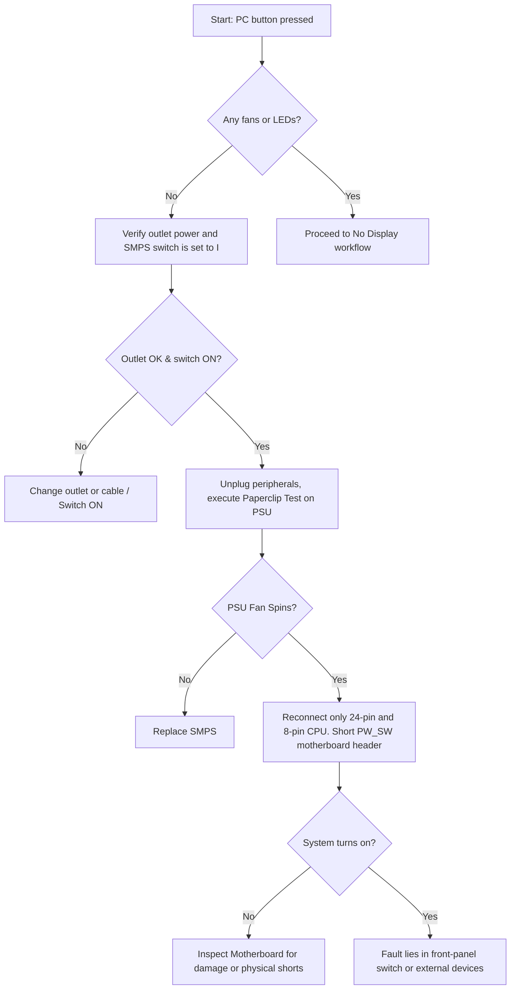

# H-06: Hardware Troubleshooting Masterclass

> [!abstract] Overview
> This note outlines advanced diagnostic workflows for identifying hardware failures, thermal anomalies, system instability, and peripheral errors. It includes diagnostic flowcharts, POST beep code matrices, tool applications, and documentation templates.

---
## Concept
Think of troubleshooting hardware like being a medical examiner or detective. When a PC crashes or fails to turn on, it cannot tell you directly what hurts. Instead, you must gather vital signs: check the power supply (blood pressure), monitor the temperatures (fever), read the BIOS beep codes/debug LEDs (vocal symptoms), run target stress tests (stress echo tests), and isolate components until the culprit is identified.

*Seedha simple mein: Hardware troubleshooting ek step-by-step detective work hai. Agar computer chal nahi raha, toh hum pehle sabse basic chizon ko check karte hain (power source, cables) aur dheere-dheere complex parts ki taraf badhte hain (RAM, CPU, Motherboard), diagnostic tools aur error codes ka use karke.*

---
## Technical Deep Dive

### 1. Diagnostic Workflows
Advanced content only — basics in [[Basic Windows troubleshooting]]

#### Workflow A: No Power (System is Electrically Dead)


#### Workflow B: No Display (POST Fails)
1. Verify the display cable is plugged into the discrete GPU, not the motherboard I/O.
2. Confirm the monitor input source matches the cable (HDMI/DP).
3. Check the motherboard Debug LEDs (CPU, DRAM, VGA, BOOT).
4. Perform a single-stick RAM test. Move the stick across slots.
5. Clear the CMOS memory.
6. Test with a known good GPU or verify boot using CPU integrated graphics.

### 2. Physical Thermal Overheating Diagnosis
- **Symptoms:** System throttling, loud fan noise, sudden thermal shutdowns (temperatures pegging at $100^\circ\text{C}$).
- **Causes:** Dried thermal paste, dust-clogged radiator fins, failing pump in an AIO liquid cooler, or fan failure.
- **Diagnostics:**
  1. Boot Windows and launch HWiNFO64 (Sensors only mode).
  2. Run Prime95 to stress CPU. Watch temperatures.
  3. If Core Temps instantly jump to $100^\circ\text{C}$ and thermal throttling reads $100\%$, check CPU cooler mounting pressure and thermal paste.
  4. If using an AIO liquid cooler, feel the tubes. If one tube is hot and the other is cold, or if the pump RPM reads $0$ in BIOS, the liquid pump has failed.

### 3. USB Device Issues: Power vs. Driver
- **Bandwidth/Power Overload:** Standard USB 3.0 ports supply 900mA at 5V. Connecting multiple high-draw devices (unpowered USB HDDs, cameras) to a passive hub causes USB controller brownouts.
- **Fix:** Connect devices directly to rear motherboard ports, or use an active, externally powered USB hub.

### 4. AMI BIOS POST Beep Code Chart
When the system fails to boot and cannot output video, the internal speaker generates beep codes:

| Beeps | Pattern | Meaning | Action / Fix |
|---|---|---|---|
| **1 Short** | `.` | Normal POST | System boot sequence is healthy. |
| **1 Long, 2 Short** | `- . .` | Video adapter card error | Reseat GPU, check PCIe power connections, replace GPU. |
| **1 Long, 3 Short** | `- . . .` | Conventional/Extended memory failure | Reseat RAM modules. Test sticks individually. |
| **5 Short** | `. . . . .` | Processor (CPU) error | CPU failure. Check for bent socket pins, reseat CPU. |
| **8 Short** | `. . . . . . . .` | Display memory Read/Write test failure | GPU memory failed. Replace graphics card. |
| **Continuous Beep** | `---` | RAM or Power Supply failure | Check power lines, test RAM, replace SMPS. |

### 5. Hardware Diagnostic Toolset Matrix
Use the correct utility for the corresponding diagnostic target:

| Tool | Primary Diagnostic Target | Operating Environment | Usage Pattern |
|---|---|---|---|
| **MemTest86** | System RAM | Bootable USB (Non-OS) | Run for at least 4 passes to detect intermittent memory errors. Zero errors allowed. |
| **CrystalDiskInfo** | Storage Health (SMART) | Windows OS | Evaluates drive state (Good, Caution, Bad) based on raw sector counts. |
| **HWiNFO64** | System Voltages & Temps | Windows OS | Run in background to monitor sensor maximums and track thermal limits. |
| **Prime95** | CPU & VRM Stability | Windows/Linux OS | Run Small FFTs test to generate maximum heat and test CPU stability. |
| **FurMark** | GPU Thermal & Power Draw | Windows OS | Stress test GPU core and VRMs. Watch for artifacting or thermal crashes. |

### 6. Troubleshooting BSOD System Crashes
Advanced content only — basics in [[SFC, DISM, BSOD basics]]

When debugging hardware-induced blue screens (e.g., `WHEA_UNCORRECTABLE_ERROR`, `SYSTEM_SERVICE_EXCEPTION`):
- Wheel errors indicate hardware failure (usually CPU voltage drops or NVMe PCIe disconnects).
- Run WinDbg to analyze memory dump files:
  ```cmd
  windbg -z C:\Windows\Minidump\xxxxxx-xx.dmp
  !analyze -v
  ```
- Look for **MODULE_NAME** or **IMAGE_NAME** to see which hardware driver (e.g., `nvlddmkm.sys` for Nvidia, `ntoskrnl.exe` for memory/CPU) triggered the crash.

---
## Lab — Step by Step
> [!info] Lab Setup Needed
> A desktop PC, Rufus software, an empty USB drive, and access to HWiNFO64, Prime95, and CrystalDiskInfo.

### Step 1: Create a MemTest86 Bootable USB
1. Download the MemTest86 Free Edition ZIP. Extract the contents.
2. Insert your USB drive. Launch the MemTest86 USB Image Writer tool.
3. Select your USB drive, click **Write**, and confirm the data wipe.

### Step 2: Test RAM Stability
1. Insert the bootable USB into the target PC. Power on and enter BIOS.
2. Set the USB drive as Boot Option #1. Save and Exit.
3. Once MemTest86 boots, press **S** to start the tests.
4. Let the test complete 1 full pass (approx 30-60 mins). Verify that the **Errors** count remains at $0$. Any error indicates faulty RAM or incorrect BIOS voltage configurations.

### Step 3: Check Disk SMART Attributes
1. Boot into Windows. Install and open **CrystalDiskInfo**.
2. Select the primary OS drive.
3. **Verify:** Check the **Health Status**. If it displays **Caution** or **Bad**, look at the raw values for ID `05` (Reallocated Sectors Count) and ID `C5` (Current Pending Sector Count).
4. If values are non-zero, prepare to backup and replace the drive.

### Step 4: Run a CPU Thermal Stress Test
1. Open **HWiNFO64** in "Sensors-only" mode. Locate CPU Core Temperatures and thermal throttling flags.
2. Launch **Prime95**. Select **Small FFTs** (maximum power/heat stress) and click OK.
3. Monitor temperature spikes in HWiNFO64. Ensure the CPU temperature stabilizes below $85^\circ\text{C}$.
4. If the temperature exceeds $95^\circ\text{C}$ and thermal throttling is marked "Yes", stop the test and check cooling.

---
## Commands Reference
```cmd
:: Windows Command Prompt
:: Check System File integrity (run as Administrator)
sfc /scannow

:: Restore local component store using online Windows Update source
DISM /Online /Cleanup-Image /RestoreHealth

:: Linux Bash
:: Read system kernel message ring buffer to check for hardware errors (e.g., machine check exceptions, I/O errors)
sudo dmesg -T | grep -i -E "error|fail|critical|mce"

:: Run CPU stress test for 60 seconds (requires stress tool installed)
stress --cpu 8 --timeout 60
```

---
## Troubleshooting Scenarios

**Scenario 1:**
- **Problem:** A workstation randomly reboots during normal office work. There is no BSOD. Event Viewer shows "Event ID 41 - Kernel-Power: The system has rebooted without cleanly shutting down first."
- **Root Cause:** A failing SMPS 12V rail or unstable voltage delivery to the CPU.
- **Fix:**
  1. Open HWiNFO64. Add a logger to record sensor output to a CSV file.
  2. Run Prime95 and monitor the $+12\text{V}$ sensor reading.
  3. If the $+12\text{V}$ rail drops below $11.4\text{V}$ (the $\pm 5\%$ limit) right before the system crashes, the PSU cannot deliver sufficient power.
  4. Replace the PSU. Verify that $+12\text{V}$ remains stable at $11.9\text{V}-12.1\text{V}$ under load.

**Scenario 2:**
- **Problem:** A user complains that files on an external USB hard drive are corrupting, and the drive occasionally disappears from File Explorer during file transfers.
- **Root Cause:** USB port power throttling. The motherboard's USB port cannot output the sustained current required to spin up and run the physical external disk platters.
- **Fix:**
  1. Open Windows **Device Manager**. Expand **Universal Serial Bus controllers**.
  2. Right-click **USB Root Hub**, select **Properties**, and go to **Power Management**.
  3. Uncheck **Allow the computer to turn off this device to save power**. Repeat for all hubs.
  4. If the issue continues, connect the drive using a USB Y-cable (drawing power from two USB ports simultaneously) or a powered USB hub.

---
## Common Mistakes
> [!warning] Avoid These
> **Replacing components before testing:** Swapping out a motherboard because a PC has "no display" without performing basic diagnostics like testing memory sticks, checking monitor inputs, or resetting the CMOS first. This wastefully increases diagnostic time and cost.
> **Correct approach:** Always start with the easiest, lowest-cost checks (resets, cable swaps, single RAM test) before declaring major components dead.

---
## Pro Tips
> [!tip] Field Experience
> When writing hardware tickets, always document the **Serial Number**, **Asset Tag**, **Motherboard BIOS Version**, and the **Exact Diagnostic Output** (e.g., "MemTest86 Pass 1 failed at address 0x00F8"). This prevents duplicate debugging and ensures that replacements are covered under correct warranties.

---
## Quick Revision Table
| # | Concept | One Line Summary |
|---|---------|-----------------|
| 1 | No Power | Disconnect load, bypass the PSU via paperclip test to verify if the SMPS starts up. |
| 2 | No Display | Inspect debug LEDs, test single-stick RAM, verify video cables are in the GPU. |
| 3 | MemTest86 | Bootable standalone diagnostic tool; if it detects even one error, the RAM is unstable. |
| 4 | Thermal Throttling | The CPU dropping speeds to protect itself when cooling fails to keep temperatures under $95^\circ\text{C}$. |
| 5 | WinDbg | Windows dump analyzer; run `!analyze -v` to identify the drivers causing BSOD crashes. |

---
## Interview Q&A

**Q1: What does a WHEA_UNCORRECTABLE_ERROR (0x124) BSOD indicate, and what is your process for troubleshooting it?**
A: A `WHEA_UNCORRECTABLE_ERROR` (Windows Hardware Error Architecture) indicates that a critical hardware error occurred. The most common causes are a failing CPU core, insufficient CPU Vcore voltage (often due to overclocking or VRM degradation), or a failing PCIe bus device (such as an NVMe SSD). My process is to first analyze the memory dump file using WinDbg to extract the error source record. If it points to `GenuineIntel` or `AuthenticAMD`, I verify CPU temperatures and restore BIOS to factory defaults. If it points to a PCIe storage controller, I run disk diagnostic tests and check physical M.2 mounts.

**Q2: A server in the data center boots, but the chassis fan controller spins all system fans at $100\%$ continuously. Explain how you would troubleshoot this.**
A: 
- **Situation:** A server's cooling fans are locked at maximum speed, creating excessive noise and power consumption.
- **Task:** Identify the sensor trigger or firmware mismatch and restore normal fan curves.
- **Action:** First, I will connect to the server's Out-of-Band management console (iDRAC/iLO) to check current sensor readings and chassis logs. If the chassis cover is open or the intrusion detection switch is triggered, fans will default to $100\%$ for safety. Second, I will check if any thermal sensor reports an error or missing readings, which also forces fans to full speed. Third, I will verify if a non-certified PCIe card (like an aftermarket GPU) has been installed, causing the server profile to force high cooling.
- **Result:** Resolving physical chassis closure or updating firmware to white-list the PCIe card returns the fan speed to normal profiles.

**Q3: What is the difference between a soft memory error and a hard memory error?**
A: A **soft memory error** is a temporary, transient error where the data bit in a RAM cell flips (e.g., from 0 to 1) due to cosmic rays, electromagnetic interference, or minor voltage fluctuations. The physical memory hardware remains undamaged, and the error can be resolved by overwriting the data or using ECC memory. A **hard memory error** is a permanent physical defect in the silicon substrate of the RAM chip. A cell or row is physically damaged, meaning it will consistently fail to hold the correct charge. Hard memory errors require physical replacement of the RAM stick.

---
## Related Notes
- [[01-Foundations/01-Hardware/H-01 Motherboard Architecture|H-01 Motherboard Architecture]] — Motherboard designs and BIOS recovery.
- [[01-Foundations/01-Hardware/H-02 Storage Deep Dive|H-02 Storage Deep Dive]] — SMART indicators and drive failures.
- [[01-Foundations/01-Hardware/H-03 SMPS Power Supply Complete Guide|H-03 SMPS Power Supply Complete Guide]] — Power rails and electrical troubleshooting.
