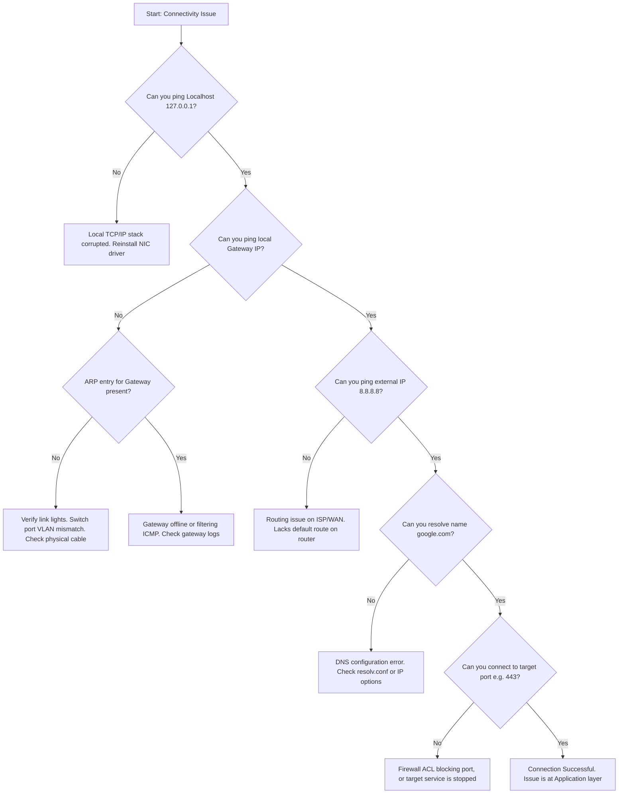

# N-10: Network Troubleshooting Complete

> [!abstract] Overview
> This note outlines advanced diagnostic workflows for isolating network connectivity, routing, and resolution failures. It details protocol stack validation, command utility parameters, Wireshark traffic analysis, and troubleshooting flowcharts.

---
## Concept
Think of troubleshooting a network like diagnosing a clean-water delivery system in a city. 
- **Physical/Link (L1/L2):** Is the pipe physically broken or disconnected? Are the connectors leaking?
- **Network (L3):** Can water travel from the treatment plant to your street block? (Routing/Ping)
- **Transport (L4):** Is the correct intake valve open at the house? (Ports/Netstat)
- **Application (L7):** Is the tap giving clean, filtered water, or is the boiler failing? (DNS/HTTP logs)
- **Wireshark** is like adding a microscopic sensor inside the pipe to analyze the exact contents, flow rate, and chemistry of every droplet passing through.

*Seedha simple mein: Network troubleshoot karne ke liye hum step-by-step diagnostic tools use karte hain. Ping connectivity check karta hai, Tracert path ke hops batata hai, Nslookup DNS check karta hai, aur Netstat active ports/connections dikhata hai.*

---
## Technical Deep Dive

### 1. Systematic Troubleshooting Framework
Always isolate network outages using a layered model (bottom-up is most effective for physical links):

```
[Application Layer]     <-- Check browser error, DNS name (nslookup)
        |
[Transport Layer]       <-- Check port availability (netstat / Test-NetConnection)
        |
[Network Layer]         <-- Check IP path and routing (ping / tracert)
        |
[Data Link/Physical]    <-- Check link lights, speed duplex settings, swap cable
```

### 2. Command Diagnostic Toolset (Deep Dive)
Advanced content only — basics in [[Basic networking commands]]

#### Ping Diagnostic Variables & TTL
Pinging sends ICMP Type 8 (Echo Request) and expects ICMP Type 0 (Echo Reply).
- **TTL (Time to Live):** A 8-bit field in the IP header that prevents packets from looping infinitely. Every router hop decrements TTL by 1. If it hits 0, the router discards the packet and sends an ICMP "Time Exceeded" message.
  - *Standard Default TTLs:* Linux/Mac $\approx 64$, Windows $\approx 128$, Cisco IOS $\approx 255$.
- **Advanced Flags (Windows):**
  - `ping -t 8.8.8.8` — Continuous ping (Ctrl+C to stop).
  - `ping -l 1472 8.8.8.8` — Send custom packet size. 1472 bytes is the max payload before fragmentation on a standard 1500-byte MTU link ($1472 \text{ payload} + 8 \text{ ICMP} + 20 \text{ IP} = 1500$).
  - `ping -f -l 1472 8.8.8.8` — Send with **DF (Don't Fragment)** flag set. Used to find path MTU limits.

#### Tracert / Traceroute Path Profiling
- **How it works:** Tracert sends packets with incrementing TTL values (starting at TTL=1). The first router decrements it to 0, drops the packet, and replies with its IP. Tracert records the IP, then sends the next packet with TTL=2, and so on.
- **Failures:** If a hop displays `* * * Request timed out`, the router at that hop is configured to block ICMP, or lacks a return route.

#### Pathping / MTR (My Traceroute)
- **Pathping (Windows):** Combines `ping` and `tracert`. It traces the path, then pings each intermediate router 100 times over 5 minutes to calculate exact packet loss statistics per hop.
- **MTR (Linux):** Real-time, continuous pathping.

#### Netstat Connection Analysis
- `netstat -an` — Shows all active connections and listening ports in numeric format (no DNS/service name lookup, making it fast).
- **Key States:**
  - `LISTENING` — Server port is open, waiting for incoming client links.
  - `ESTABLISHED` — Connection is active and data is transferring.
  - `TIME_WAIT` — Client closed the connection; port remains reserved to catch delayed packets.

#### Local Routing Table Print
`route print` (Windows) or `ip route` (Linux) shows the local routing database:
- **`0.0.0.0 0.0.0.0`** entry defines the Default Gateway interface.

### 3. Wireshark Traffic Analysis Basics
Wireshark captures raw frames from the physical NIC using PCAP libraries.
- **Color Codes:** Black usually indicates packet TCP resets, retransmissions, or checksum errors.
- **Useful Filters:**
  - `ip.addr == 192.168.1.50` — Show all packets sent to or from this IP.
  - `tcp.port == 443` — Filter for HTTPS traffic.
  - `dns` — Filter for DNS queries and replies.
  - `http.request` — Show outgoing HTTP request packets.
  - `tcp.flags.reset == 1` — Find broken connection reset commands.

---
## The Complete Network Troubleshooting Flowchart


---
## Commands Reference
```powershell
# Windows PowerShell
Test-NetConnection -ComputerName 192.168.1.50 -Port 443      # Test if target TCP port is open
Resolve-DnsName www.google.com                               # Advanced DNS lookup details
Get-NetRoute -AddressFamily IPv4                             # View Windows IPv4 routing table

# Linux Bash
sudo tcpdump -i eth0 -c 10 icmp                              # Capture first 10 ICMP packets on eth0
nc -zv 192.168.1.50 443                                      # Netcat port scan (verify port 443 is listening)
mtr -c 10 -r 8.8.8.8                                         # Generate clean 10-packet path report
```

---
## Troubleshooting Scenarios

**Scenario 1:**
- **Problem:** User reports they cannot connect to a legacy internal web server. The browser returns "Connection Refused". Pinging the server IP succeeds.
- **Root Cause:** The web server service (IIS/Apache) has stopped, or it is listening on a different port than HTTP/80.
- **Fix:**
  1. Open PowerShell on the client. Run `Test-NetConnection [Server_IP] -Port 80`. If it returns `TcpTestSucceeded : False`, the port is closed.
  2. RDP/SSH into the web server.
  3. Run `netstat -ano | findstr LISTENING`.
  4. Verify if a process is listening on port 80. If not, start the Web Server service (e.g., `Start-Service W3SVC` on IIS).
  5. Re-test port connectivity from the client.

**Scenario 2:**
- **Problem:** Workstation speeds drop to near-zero when copying large files to the local NAS storage. Pinging the NAS under load returns high response variations and packets drop.
- **Root Cause:** MTU mismatch causing packet fragmentation. The workstation has Jumbo Frames (MTU 9000) enabled, but the intermediate switch only supports standard MTU (1500).
- **Fix:**
  1. Run ping tests from the workstation with the DF (Don't Fragment) flag:
     ```cmd
     ping -f -l 8000 [NAS_IP]
     ```
  2. If it returns "Packet needs to be fragmented but DF set", lower the packet size until pings pass.
  3. Change the workstation adapter configuration: Disable Jumbo Frames, returning MTU to the default `1500`.
  4. Run transfer test and confirm performance stabilizes.

---
## Common Mistakes
> [!warning] Avoid These
> **Running traceroute without knowing target network policies:** Assuming a remote host is offline because `tracert` stops responding at hop 5. Many firewalls block ICMP time-exceeded messages, making the host appear offline even if HTTP/SSH ports are open.
> **Correct approach:** Always supplement ping/traceroute checks with port-specific scanners (like `Test-NetConnection` or `nc`) to verify actual application endpoints.

---
## Pro Tips
> [tip] Field Experience
> When troubleshooting remote network drops, always run a continuous ping with timestamps logged to a file: `ping -t 8.8.8.8 | Foreach{"{0} - {1}" -f (Get-Date),$_} > ping_log.txt`. This allows you to correlate network disconnections against customer timeline complaints or syslog event times.

---
## Quick Revision Table
| # | Concept | One Line Summary |
|---|---------|-----------------|
| 1 | TTL | Time to Live; decremented at each router hop to prevent loop routing packets. |
| 2 | Tracert | Diagnoses path routing by sending packets with incrementing TTL markers. |
| 3 | Netstat | Port scanner helper showing local port state states (LISTENING, ESTABLISHED). |
| 4 | Wireshark Filter| Query strings (e.g., `tcp.port == 443`) that isolate relevant network traffic. |
| 5 | MTU Test | Using ping (`ping -f -l [size]`) to determine the path MTU limit before fragmentation. |

---
## Interview Q&A

**Q1: A user reports they can access internal resources, but cannot open external websites. Walk through your troubleshooting methodology.**
A: 
- **Situation:** Local internal L2/L3 works, but external WAN communication is broken.
- **Task:** Diagnose where the connection breaks on the path to the WAN.
- **Action:** First, I will verify IP details (`ipconfig /all`). I need to check the gateway and DNS addresses. Second, I will ping the default gateway to check local L3 connection. Third, I will ping an external IP (`8.8.8.8`). If pinging `8.8.8.8` fails but pinging the gateway works, the issue is on the ISP router or WAN link. If pinging `8.8.8.8` succeeds, I will ping `google.com`. If that fails, it is a DNS resolution failure.
- **Result:** Resolving the ISP gateway route or fixing DNS server settings on the workstation restores external access.

**Q2: What is a packet fragment storm, and how does it impact router CPU performance?**
A: A packet fragment storm occurs when a router must process large volumes of packets that exceed the MTU of the outgoing interface. Because the packet cannot pass as-is, the router's main CPU must fragment the packet into smaller chunks, write new IP headers for each fragment, recalculate checksums, and forward them. If the destination drops a single fragment, the entire sequence must be resent. This process runs in the software control plane of the router CPU rather than the hardware data plane, saturating the CPU and slowing down all traffic.

**Q3: How do you identify a TCP SYN Flood DDoS attack using Netstat?**
A: A TCP SYN Flood attack is an exploit where an attacker sends thousands of SYN packets to a server but never responds to the server's SYN-ACKs, occupying all connection slots. To identify this, I will run `netstat -an` and count the connections. If I see hundreds of connections to a specific port (like port 80 or 443) stuck in the **`SYN_RECEIVED`** or **`SYN_RECV`** state originating from spoofed external IPs, it confirms a active SYN flood attack.

---
## Related Notes
- [[01-Foundations/02-Networking/N-01 Networking Fundamentals|N-01 Networking Fundamentals]] — The 7 layers of the OSI model.
- [[01-Foundations/02-Networking/N-03 Ethernet and MAC Address|N-03 Ethernet and MAC Address]] — ARP caches and frame details.
- [[01-Foundations/02-Networking/N-08 IP Services — DHCP DNS NAT|N-08 IP Services — DHCP DNS NAT]] — Resolution DNS and routing NAT helpers.


---

### Enterprise Networking & Wireless Analysis

#### 1. Wireshark Packet Capture Filtering
Use these filters during packet capture analysis to isolate issues quickly:
- **HTTP POST Request Error isolation**: `http.request.method == "POST" && http.response.code >= 400`
- **Isolate TCP Retransmissions (Packet Loss)**: `tcp.analysis.retransmission || tcp.analysis.duplicate_ack`
- **DNS Server response failures check**: `dns.flags.response == 1 && dns.flags.rcode != 0`
- **Isolate host traffic (excluding noise)**: `ip.addr == 192.168.1.50 && !arp && !dns`

#### 2. Wireless Troubleshooting (Enterprise Wi-Fi)
- **802.1X EAP Authentication Failed**: Verify certificate validation settings on RADIUS server (NPS); check client identity store configuration.
- **Roaming failure (sticky client)**: Adjust Minimum RSSI settings on wireless access points (APs) or check that both APs broadcast identical SSIDs with overlapping coverage ranges (15-20% overlap).
- **RF Interference**: Run a channel survey; move corporate APs from saturated 2.4GHz bands to clean 5GHz/6GHz channels using 20MHz or 40MHz channel widths.

#### 3. Software-Defined WAN (SD-WAN) Basics
- **What it is**: SD-WAN decouples the network control plane from the physical hardware forwarding plane. It manages WAN links (MPLS, Broadband, LTE) dynamically.
- **Why it matters**: It automatically routes business-critical traffic (like VoIP) over the lowest latency links while routing general web traffic over cheap broadband, using real-time link quality metrics (jitter, packet loss, latency).
