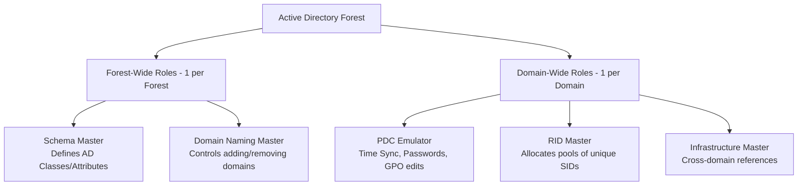

---
tags: [desktop-support, active-directory, system-administration, fsmo-roles, L3]
aliases: [fsmo-guide, ntdsutil-fsmo, ad-roles]
created: 2026-06-25
status: #complete
difficulty: #advanced
cert-relevant: #md-102
---

# FSMO Roles (Flexible Single Master Operations)

---

## Concept Overview
- **What it is**: Flexible Single Master Operations (FSMO) roles are specialized tasks assigned to specific Domain Controllers (DCs) in an Active Directory forest to prevent conflicts that occur in multi-master replication environments. While standard AD operations (like user creation) can happen on any DC, FSMO tasks must be handled by a single designated DC.
- **Why it matters for a support engineer**: Although FSMO role management is typically an L3 task, L1/L2 engineers must understand FSMO roles to diagnose replication blockages, account creation failures, time sync drifts, and password lockout delay issues.
- **Where you encounter this in real job**: Demoting an old Domain Controller, troubleshooting RID exhaustion when creating new user accounts, and resolving network time protocol (NTP) syncing failures.
- **L1 vs L2 vs L3 responsibility split**:
  - **L1**: Identifies time sync issues on client PCs and checks basic domain availability.
  - **L2**: Queries the active FSMO role holders, troubleshoots local password sync delays, and checks DC health using diagnostics tools.
  - **L3**: Transfers or seizes FSMO roles during DC migrations or disaster recovery scenarios, and maintains schema integrity.

---

## Technical Deep Dive

### 1. The Five FSMO Roles
Active Directory divides FSMO roles into two categories: Forest-wide (one per forest) and Domain-wide (one per domain).



#### Forest-Wide Roles
1. **Schema Master**: 
   - *Purpose*: Controls all modifications to the Active Directory schema (the blueprint of AD classes and attributes, like adding custom attributes for exchange or third-party tools).
   - *Impact if offline*: You cannot upgrade the domain schema (e.g., preparing for a newer Windows Server version or installing Exchange). Daily user operations are unaffected.
2. **Domain Naming Master**:
   - *Purpose*: Authorizes the addition or removal of domains, subdomains, and directory partitions in the forest.
   - *Impact if offline*: You cannot add new child domains or rename existing domains. Daily user operations are unaffected.

#### Domain-Wide Roles
3. **RID (Relative Identifier) Master**:
   - *Purpose*: Allocates pools of Relative Identifiers (RIDs) to all Domain Controllers in the domain. Every security object (user, group, computer) has a Security Identifier (SID) consisting of a Domain SID + a unique RID.
   - *Impact if offline*: DCs can continue creating objects using their existing RID pool. Once a DC exhausts its local RID pool (typically blocks of 500), it cannot create any new users, groups, or computers.
4. **PDC (Primary Domain Controller) Emulator**:
   - *Purpose*: 
     - Acts as the master time source (NTP) for the domain.
     - Receives immediate replication of password changes. If a user enters a wrong password on a standard DC, that DC checks with the PDC Emulator before rejecting the logon.
     - Manages Group Policy Object (GPO) locks during editing to prevent overlaps.
   - *Impact if offline*: Immediate issues: client computer clocks drift (causing Kerberos authentication failures), password changes take longer to propagate, and GPO editing conflicts occur.
5. **Infrastructure Master**:
   - *Purpose*: Updates references from objects in its domain to objects in other domains (e.g., when a user from Domain A is added to a security group in Domain B).
   - *Impact if offline*: Cross-domain object references may display GUIDs instead of usernames. Note: If all DCs are Global Catalogs (common in modern environments), the Infrastructure Master has no active work to perform.

### 2. Transfer vs. Seizure
- **Transfer**: A controlled, clean migration of a FSMO role from one healthy DC to another. Done prior to decommissioning a DC.
- **Seizure**: A forced takeover of FSMO roles from a Domain Controller that has suffered a catastrophic hardware failure and is permanently offline.
  - *WARNING*: Once a role (especially Schema, Domain Naming, or RID Master) is seized from an offline DC, **the original DC must never be powered back online**. If it returns, you will experience metadata conflicts, replication loops, and AD database corruption. You must format the old DC's operating system.

---

## Commands & Syntax

### PowerShell
```powershell
# Identify which Domain Controllers hold the FSMO roles in the domain
Get-ADDomain | Select-Object InfrastructureMaster, RIDMaster, PDCEmulator
Get-ADForest | Select-Object SchemaMaster, DomainNamingMaster

# Transfer a single FSMO role (e.g., PDC Emulator) to a target DC
Move-ADDirectoryServerOperationMasterRole -Identity "DC-02" -OperationMasterRole PDCEmulator -Confirm:$false

# Transfer all 5 FSMO roles in a single command using index numbers (0: PDCEmulator, 1: RIDMaster, 2: InfrastructureMaster, 3: SchemaMaster, 4: DomainNamingMaster)
Move-ADDirectoryServerOperationMasterRole -Identity "DC-02" -OperationMasterRole 0,1,2,3,4 -Confirm:$false

# Seize FSMO roles from a permanently offline DC (Force parameter)
Move-ADDirectoryServerOperationMasterRole -Identity "DC-02" -OperationMasterRole PDCEmulator -Force -Confirm:$false
```

### CMD / Run Box (Ntdsutil tool)
`ntdsutil` is the command-line utility for managing the Active Directory database.
```cmd
:: Quick command to view all FSMO role holders
netdom query fsmo

:: Manual role transfer/seizure via ntdsutil
ntdsutil
roles
connections
connect to server DC-02
quit
transfer pdc
:: (or type "seize pdc" if the original DC is dead)
quit
quit
```

### GUI Path
- **RID, PDC, Infrastructure Masters**: Open **Active Directory Users and Computers** -> Right-click Domain -> **Operations Masters...**.
- **Domain Naming Master**: Open **Active Directory Domains and Trusts** -> Right-click root node -> **Operations Manager...**.
- **Schema Master**: Run `regsvr32 schmmgmt.dll` -> Open `mmc` -> Add **Active Directory Schema** snap-in -> Right-click root node -> **Operations Master...**.

### Key Event IDs
- **Event ID 1458 (Directory Services Log)**: Logged when a Domain Controller successfully transfers or seizes an operations master role.
- **Event ID 1655 (Directory Services Log)**: Logged when a DC is unable to locate the RID Master to request a new RID pool.

---

## Real-World Scenarios

### Scenario 1: Staff Cannot Create New AD Objects (RID Pool Exhaustion)
**User Complaint:** A helpdesk L2 technician complains: *"I am trying to provision 20 new contract employees in Active Directory, but every time I click 'Finish', I get an error: 'Windows cannot create the object because the Directory Service was unable to allocate a relative identifier.' Existing users can log in fine."*
**Your First 3 Checks:**
1. Run `netdom query fsmo` to identify the current RID Master.
2. Check network connectivity and ping from the local DC to the RID Master.
3. Check replication status using `repadmin /replsummary`.
**Diagnosis Steps:**
1. Open PowerShell on the local DC where the tech is connected. Run:
   `Get-ADDirectoryServer -OperationMasterRID`
   - Target RID Master: `DC-OLD.company.local`
2. Ping `DC-OLD.company.local`. The server is offline and unreachable.
3. Check with the infrastructure team. `DC-OLD` was decommed last week, but the admin forgot to transfer the FSMO roles before turning it off.
4. The local DC has run out of its allocated pool of 500 RIDs and cannot generate the SIDs needed for new accounts.
**Root Cause:** The RID Master was decommissioned/powered off without transferring the RID Master FSMO role, leading to RID pool exhaustion on standard DCs.
**Fix:**
1. Open PowerShell as administrator on a healthy DC (`DC-02`).
2. Seize the RID Master role:
   `Move-ADDirectoryServerOperationMasterRole -Identity "DC-02" -OperationMasterRole RIDMaster -Force -Confirm:$false`
3. Verify the role is held by the new DC: `netdom query fsmo`.
4. Instruct the helpdesk technician to retry creating the accounts.
**Prevention:** Always run checklist checks before demoting or turning off legacy Domain Controllers.
**Ticket Close Note:** "Seized the RID Master FSMO role to DC-02 since DC-OLD was decommissioned. Confirmed new accounts can be created. Closed."

### Scenario 2: Active Directory GPO Changes Overwriting Each Other
**User Complaint:** L2 administrators report that when editing Group Policies from different locations, changes are randomly disappearing, and policy deployment is inconsistent.
**Your First 3 Checks:**
1. Verify the PDC Emulator role holder.
2. Check system time synchronization on the PDC Emulator and all DCs.
3. Query the Event Viewer on the PDC emulator for time service alerts.
**Diagnosis Steps:**
1. Run `netdom query fsmo`. The PDC emulator role is held by `DC-TimeServer`.
2. Compare system time:
   - Client workstation: `10:15 AM`
   - Standard DC-02: `10:15 AM`
   - PDC Emulator (`DC-TimeServer`): `10:27 AM` (12 minutes ahead).
3. The time drift on the PDC Emulator is causing Kerberos tickets to expire and GPOs (which rely on UTC timestamps) to show conflict errors.
4. Investigating further, `DC-TimeServer` is a virtual machine and its NTP settings were overwritten to sync with the Hyper-V host clock, which was drifting.
**Root Cause:** The PDC Emulator had a time-sync drift, affecting the Kerberos ticketing system and GPO replication metadata timestamps.
**Fix:**
1. Configure the PDC Emulator to sync with an external NTP server (e.g., `pool.ntp.org`):
   `w32tm /config /manualpeerlist:"0.pool.ntp.org 1.pool.ntp.org" /syncfromflags:manual /reliable:yes /update`
2. Force time sync on the PDC: `w32tm /resync`.
3. Force replication across all DCs: `repadmin /syncall /Adpe`.
**Prevention:** Ensure the PDC Emulator role holder is explicitly set to sync with a reliable external time service rather than relying on VM host integration clocks.
**Ticket Close Note:** "Corrected NTP sync on PDC Emulator DC-TimeServer. Re-synced all DC clocks. Verified GPO changes now save correctly. Closed."

---

## Critical Points

> [!danger] Never Do This
> - Never power on a Domain Controller whose FSMO roles (RID, Schema, Domain Naming) have been seized by another DC.
> - This creates a split-brain scenario where two DCs claim to own the same master operations, causing replication to fail permanently and leading to Active Directory database corruption.

> [!warning] Common Trap
> - Placing the Infrastructure Master role on a Domain Controller that is NOT a Global Catalog (GC) server, while other DCs in the domain are GCs.
> - If the Infrastructure Master is not a GC, and other servers are, the Infrastructure Master will fail to find cross-domain references and stop updating them.
> - *Rule of Thumb*: Either make all DCs Global Catalogs (standard practice today), or ensure the Infrastructure Master role is on a DC that is not a Global Catalog.

> [!tip] Senior Engineer Tip
> - When migrating FSMO roles to a new server, always use PowerShell script transfers rather than GUI consoles. The GUI consoles can occasionally time out or require complex snap-in registrations (like Schema Master), whereas `Move-ADDirectoryServerOperationMasterRole` executes the transfer instantly.

> [!success] Verification Steps
> - Run: `netdom query fsmo` on any domain-joined client to quickly verify the current holders of all five FSMO roles.
> - Run: `repadmin /showrepl` to confirm that the replication topology is healthy after a role transfer.

> [!question] Interview Alert
> - "What happens to Active Directory if the PDC Emulator role holder goes offline?"
> - Answer: "If the PDC Emulator goes offline, users may experience login delays when changing passwords, client machine times will drift (leading to Kerberos authentication failures), and administrators will face conflicts when editing Group Policies. The PDC Emulator must be recovered or seized quickly."

---

## Common Mistakes & Fixes

| Mistake | Why It Happens | Correct Approach |
|---------|----------------|------------------|
| Seizing roles when DC is temporarily offline | Impatience during a reboot | Only seize roles if the DC is permanently dead; wait for normal boot if it's a temp outage. |
| Neglecting to register Schema DLL | Schema Master MMC console is hidden | Run `regsvr32 schmmgmt.dll` to unlock the Active Directory Schema console in MMC. |
| Forgetting to designate PDC as reliable time source | Default virtual machine configuration | Set the PDC Emulator to sync with an external NTP server and configure other DCs to sync from PDC. |

---

## Lab Exercise

**Objective:** Query FSMO roles in your lab environment, transfer the PDC Emulator role to a backup DC, and verify the transfer.
**Time Required:** 20 minutes
**Environment Needed:** Two Windows Server VMs acting as Domain Controllers in the same domain.
**Pre-requisites:** AD DS active and replication verified between both DCs.

**Steps:**
1. Open PowerShell as Administrator on the primary DC (`DC-01`).
2. Query the current FSMO role holders:
   ```powershell
   Get-ADDomain | Select-Object InfrastructureMaster, RIDMaster, PDCEmulator
   ```
3. Transfer the PDC Emulator role to `DC-02` using PowerShell:
   ```powershell
   Move-ADDirectoryServerOperationMasterRole -Identity "DC-02" -OperationMasterRole PDCEmulator -Confirm:$false
   ```
4. Verify the transfer using `netdom`:
   ```cmd
   netdom query fsmo
   ```
5. Confirm `DC-02` is now listed as the PDC Emulator.
6. Open **Active Directory Users and Computers**, right-click the domain name, click **Operations Masters**, click the **PDC** tab, and verify `DC-02` is shown as the current operations master.

**Success Criteria:** The PDC Emulator role is successfully transferred to `DC-02` and verified via both PowerShell and the GUI console.
**Common Failures:** The command fails if replication is broken between the two DCs or if the administrative user lacks Domain Admin privileges.

---

## Interview Questions & Answers

### Basic (L1 Level)
**Q: What are the two types of FSMO roles in Active Directory?**
A: The two types are Forest-wide roles (which exist once in the entire Active Directory Forest) and Domain-wide roles (which exist once per domain inside the forest).

**Q: Which command shows who holds the FSMO roles in a domain?**
A: I can open Command Prompt on any domain machine and run the command `netdom query fsmo` to see all 5 role holders listed.

### Intermediate (L2 Level)
**Q: What is the difference between transferring a FSMO role and seizing a FSMO role?**
A: A transfer is a clean, planned migration of a FSMO role from one online Domain Controller to another, usually performed during DC upgrades. A seizure is a forced migration of FSMO roles from a Domain Controller that has crashed and cannot be recovered. Seizure should only be done as a last resort because the old DC can never be brought back online.

**Q: What happens if the RID Master goes offline?**
A: If the RID Master goes offline, existing users can continue working, and DCs can still create new objects as long as they have remaining RIDs in their local pool. However, once a DC runs out of its RID pool, it will fail to create any new users, groups, or computer accounts until the RID Master is restored or seized.

### Advanced (L3/Senior Level)
**Q: How does the PDC Emulator role impact authentication, and why is it critical for time synchronization?**
A:
- **Situation**: Designing password policy validation and time synchronization baselines.
- **Task**: Explain PDC Emulator functions and disaster mitigation.
- **Action**: The PDC Emulator serves as the ultimate authority for password validation; if a local DC cannot validate a user's password, it contacts the PDC Emulator to verify if the password was recently changed. Additionally, the PDC acts as the primary time authority (NTP server) for all DCs, which in turn sync client computers. If the PDC's time drifts beyond 5 minutes from the client, Kerberos authentication fails completely.
- **Result**: Proactive monitoring of the PDC Emulator's NTP sync status prevents domain-wide logon outages.

### HR / Behavioral
**Q: Describe a time you had to deal with an unplanned system outage. How did you diagnose it?**
A: Our primary DC suffered a motherboard failure, and helpdesk reported they could not create new user accounts for incoming hires. I diagnosed the issue as FSMO role loss, specifically the RID Master. I verified the old DC was unrecoverable, logged into the secondary DC, and forced a seizure of the FSMO roles using `ntdsutil`. This restored the account provisioning capability within 30 minutes, minimizing the onboarding delay.

---

## Quick Revision Sheet
> [!info] 60-Second Summary
> **What**: Five specialized roles in AD to prevent database write conflicts in a multi-master replication model.
> **Why**: Critical for schema updates, time synchronization, password updates, and creating new object SIDs.
> **How**: Forest-wide (Schema, Naming) and Domain-wide (PDC, RID, Infrastructure). Manage via PowerShell `Move-ADDirectoryServerOperationMasterRole` or `ntdsutil`.
> **Command**: `netdom query fsmo` / `Move-ADDirectoryServerOperationMasterRole`
> **Interview Answer Starter**: "FSMO roles are single-master services in Active Directory. There are five roles: two forest-wide, three domain-wide. They ensure conflict-free updates..."

**Key Numbers to Remember:**
- Forest-wide roles: 2 (Schema Master, Domain Naming Master)
- Domain-wide roles: 3 (PDC Emulator, RID Master, Infrastructure Master)
- Default size of RID pool allocated to DCs: 500 RIDs
- Kerberos maximum allowed clock skew: 5 minutes

**3 Things Interviewer Wants to Hear:**
- The difference between transfer (clean) and seizure (forced)
- Why the old holder of a seized role must never be brought back online
- How PDC Emulator handles immediate password change replication and NTP time synchronization

---

## Related Notes
- [[03-Identity-and-Core-Services/05-Windows-Server/Roles|Windows Server Roles]] — Outlines DC roles and Active Directory features.
- [[03-Identity-and-Core-Services/06-Active-Directory/AD-Replication|AD Replication]] — Explains how updates sync between DCs.
- [[03-Identity-and-Core-Services/06-Active-Directory/Users-and-Groups|Users and Groups]] — Discusses objects created using RID allocation.

---

## Tags
#desktop-support #active-directory #system-administration #fsmo-roles #L3 #interview-topic #lab-complete #daily-use

