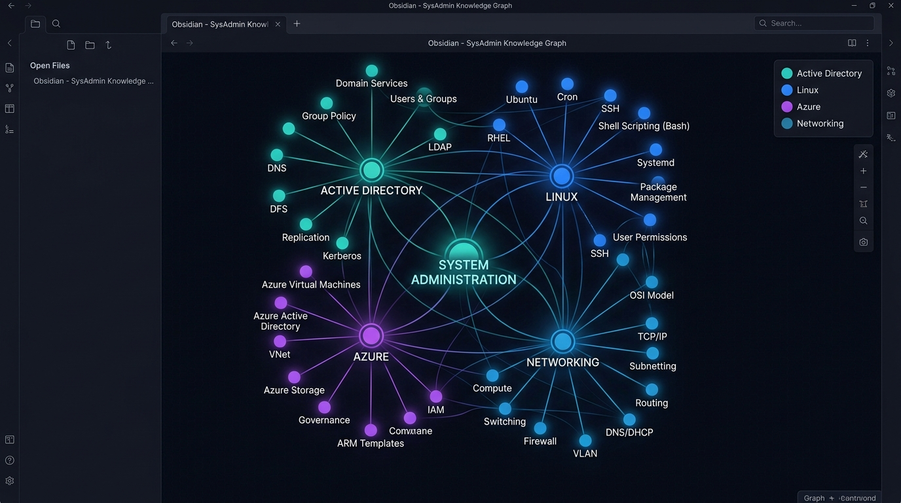

# 🛠️ System Administrator & Desktop Support Engineer Knowledge Vault

[](./00-MOC/Master-Index.md)
[](https://github.com/ashwanisingh2/SYSTEM-ADMINISTRATOR)
[](https://opensource.org/licenses/MIT)
[](https://obsidian.md)

Welcome to the **System Administrator & Desktop Support Engineer (L1 to L3) Knowledge Vault**. This is a comprehensive, production-grade documentation repository and study resource structured as an **Obsidian Vault**. It covers everything from basic hardware support (L1) to advanced cloud infrastructure and systems administration (L3).

---

## 🗺️ Obsidian Graph View

Here is a visual map of how all the topics, concepts, and runbooks connect together inside the vault:



---

## 📁 Repository Structure

```
SYSTEM-ADMINISTRATOR/
 ├── 📂 00-MOC/                   # Master Index, Cheat Sheets, Interview Q&As, Troubleshooting Trees
 ├── 📂 01-Foundations/
 │    ├── 📂 01-Hardware/         # Motherboard, Storage, Virtualization Labs (VMware, VirtualBox, Hyper-V)
 │    └── 📂 02-Networking/       # IPv4/v6 Subnetting, Routing, DNS/DHCP Services, ACLs
 ├── 📂 02-Operating-Systems/
 │    ├── 📂 03-Windows-OS/       # Registry, Event Viewer, SFC/DISM, OS Services, User Profiles
 │    └── 📂 04-Linux-RHEL/       # CLI, LVM, SSH Hardening, Systemd, Bash Scripting (L-01 to L-13)
 ├── 📂 03-Identity-and-Core-Services/
 │    ├── 📂 05-Windows-Server/   # Windows Server 2022, DFS, RAID, VPN/RRAS
 │    └── 📂 06-Active-Directory/ # AD DS, Group Policy, FSMO, AD CS
 ├── 📂 04-Cloud-and-Security/
 │    ├── 📂 07-Microsoft-365/    # Exchange Online, Teams/SharePoint, Intune MDM/MAM
 │    ├── 📂 08-Azure/            # AZ-900 / AZ-104 Administration, VM Scale Sets
 │    └── 📂 09-Security/         # Zero Trust, BitLocker, MFA, Incident Response Playbooks
 └── 📂 05-Automation-and-Ticketing/
      ├── 📂 10-Scripting-PowerShell/ # Active Directory Automation, Az Modules
      └── 📂 11-ITSM-Ticketing/       # ITIL v4, SLA, Incident & Change Management
```

---

## 👥 Who Is This For?

*   **Fresher Desktop Support Engineers (L1)**: Looking to handle daily hardware, networking, and basic OS troubleshooting tasks while building up skills to level up.
*   **System Administrators (L2/L3)**: Managing Active Directory, group policies, enterprise networking, scripting automation, and server configurations.
*   **Certification Candidates**: Studying for industry-leading certifications like **RHCSA**, **MD-102 (Endpoint Administrator)**, **AZ-104 (Azure Administrator)**, and **CCNA**.
*   **IT Infrastructure Enthusiasts**: Building home labs or reference environments.

---

## 🚀 How to Use this Vault

### 1. 📂 Open in Obsidian (Recommended)
This repository is optimized for **[Obsidian](https://obsidian.md/)** (a local markdown-based knowledge management tool) to enable rich cross-linking and graphical node views:
1. Download and install Obsidian.
2. Choose **"Open folder as vault"**.
3. Select this repository's root directory (`SYSTEM-ADMINISTRATOR`).
4. Start with the [**`00-MOC/Master-Index.md`**](./00-MOC/Master-Index.md) file to navigate.

### 2. 📖 Standard Markdown Reading
You can also browse this repository directly on GitHub or using any markdown reader. Links are configured using relative paths for seamless navigation.

---

## 🤝 How to Contribute

Contributions to expand and upgrade the vault are highly welcome!
1. **Fork the Repository**.
2. **Create a Feature Branch**:
   ```bash
   git checkout -b feature/L-14-linux-hardening
   ```
3. **Adhere to the Template**: Ensure all new notes strictly follow the [GOD MODE Note Template](./.agents/AGENTS.md) (front matter metadata, Concept Overview, bilingual Hindi/English explanations, step-by-step lab, cheat sheet, troubleshooting table, and interview questions).
4. **Submit a Pull Request**: Provide a detailed description of the additions or fixes made.

---
*Maintained with ❤️ by Ashwani Singh.*
